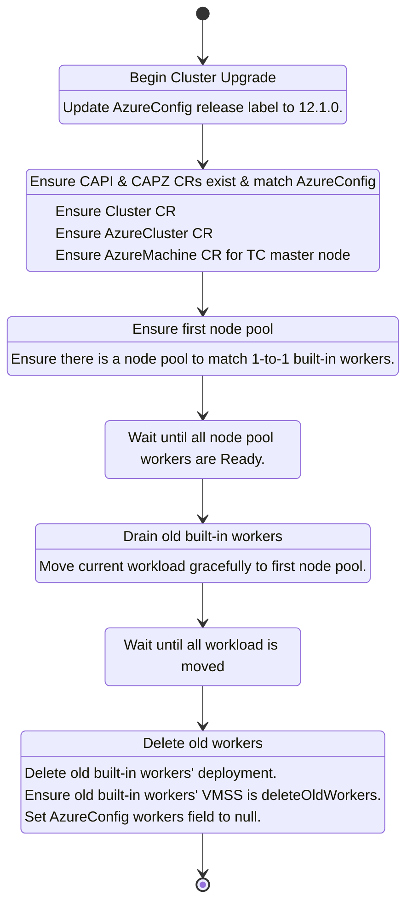

# Cluster upgrade process to node pools cluster in Azure

Following diagram describes the upgrade process in high level.

```mermaid
stateDiagram-v2
state "Begin Cluster Upgrade" as beginUpgrade

[*] --> beginUpgrade

beginUpgrade : Update AzureConfig release label to 12.1.0.
beginUpgrade --> ensureCRs

ensureCRs : Ensure CAPI & CAPZ CRs exist & match AzureConfig 
ensureCRs : Ensure Cluster CR
ensureCRs : Ensure AzureCluster CR
ensureCRs : Ensure AzureMachine CR for TC master node

ensureCRs --> ensureNP

ensureNP : Ensure first node pool
ensureNP : Ensure there is a node pool to match 1-to-1 built-in workers.

waitForNP : Wait until all node pool workers are Ready.
ensureNP --> waitForNP

drainOldWorkers : Drain old built-in workers
drainOldWorkers : Move current workload gracefully to first node pool.

waitForNP --> drainOldWorkers

waitForWorkload : Wait until all workload is moved
drainOldWorkers --> waitForWorkload

deleteOldWorkers : Delete old workers
deleteOldWorkers : Delete old built-in workers' deployment.
deleteOldWorkers : Ensure old built-in workers' VMSS is deleteOldWorkers.
deleteOldWorkers : Set AzureConfig workers field to null.

waitForWorkload --> deleteOldWorkers
deleteOldWorkers --> [*]

```
