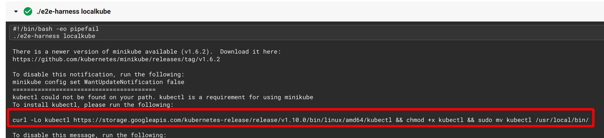
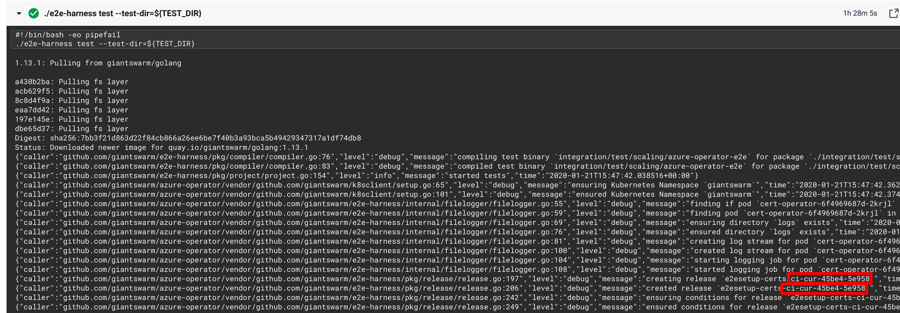

# Debugging e2etests

Sometimes e2e tests fail and we need to figure out why.
These tests will normally create a local kubernetes cluster where our operators will be installed and Custom Resources
will be created to spin up tenant clusters on the tested provider.

If we want to debug what happened, the first thing we would need to do would be to re-run the failed job in CircleCI
enabling SSH so we can later connect to the CircleCI worker running the job. Click on the following button to do that:


The job will be re executed, but this time there is a new step that let's you connect to the worker using SSH.


## Inspecting control plane cluster

Let's _ssh_ into the CircleCI worker to install `kubectl` so we can talk to our test cluster.
Copy and run the command from this step:



For example:
```bash
curl -Lo kubectl https://storage.googleapis.com/kubernetes-release/release/v1.10.0/bin/linux/amd64/kubectl && chmod +x kubectl && sudo mv kubectl /usr/local/bin/
```

The `kubeconfig` file needed to connect to the test cluster was created during the environment preparation.
We can inspect the control plane cluster using `kubectl` and that `kubeconfig`:

```bash
export KUBECONFIG="/home/circleci/.kube/config
kubectl get nodes
```

Now we can see the content of our Custom Resources created on the control plane and check if they look correct.
For example:
```bash
kubectl get azureconfigs
```


## Using Helm with the control plane cluster

[The Custom Resources](https://github.com/giantswarm/apiextensions/tree/master/helm) required for the tests are
installed as Helm charts, so it would be a good idea to install Helm and inspect the installed charts.

There are several different Helm releases, and we need to use one that's compatible with the currently installed `tiller`.
Let's check our `tiller` version:

```bash
kubectl get deployment -n kube-system -l name=tiller,app=helm -o jsonpath="{..image}"
```

We know the version that we need, let's install Helm:

```bash
export HELM_VERSION="v2.16.2"
curl -L "https://get.helm.sh/helm-${HELM_VERSION}-linux-amd64.tar.gz" > ./helm.tar.gz
tar xzvf helm.tar.gz
chmod u+x linux-amd64/helm
sudo mv linux-amd64/helm /usr/local/bin/
```

Now we can list the installed charts

```bash
helm list
```

Or even get the values that were used to install those charts

```bash
helm get values <release-name>
```


## Operator logs

We can take a look at the operator logs while is being tested.

```bash
kubectl logs -n giantswarm deploy/azure-operator -f
```

We can improve the output thanks to [our tool luigi](https://github.com/giantswarm/luigi):

```bash
GO111MODULE="on" go get github.com/giantswarm/luigi
kubectl logs -n giantswarm deploy/azure-operator -f | luigi
```


## Inspecting resources on the cloud provider

The operator will create resources on the cloud provider, like the tenant clusters. Sometimes it's useful to go to the
provider console and see what's going on.
On Azure we can find the resource groups being used to hold the tenant clusters on the `standardverzeichnis`
subscription (accountsgiantswarm).

Let's go to the Azure portal. On the resource group search box we should look for resource groups whose name starts with `ci-`.

We should see a list of the resource groups for our e2e tests. We need to look for the resource group name on the
CircleCI job logs to know which resource group is being used on each job.


